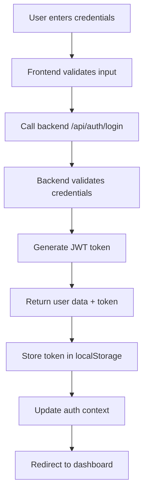

# BaseWave Pulse Frontend Documentation

## 📋 Table of Contents
- [Overview](#overview)
- [Architecture](#architecture)
- [Pages & Routes](#pages--routes)
- [Components](#components)
- [Contexts & State Management](#contexts--state-management)
- [Services & API Integration](#services--api-integration)
- [UI/UX Design System](#uiux-design-system)
- [Authentication Flow](#authentication-flow)
- [Configuration](#configuration)
- [Development Guidelines](#development-guidelines)
- [Deployment](#deployment)

## 🚀 Overview

BaseWave Pulse Frontend is a modern, responsive Next.js application that provides a comprehensive dashboard for AI-driven content management, SEO optimization, and business analytics. Built with TypeScript, Tailwind CSS, and modern React patterns.

### Key Features
- **Modern Dashboard Interface**: Clean, intuitive admin panel with dark/light theme support
- **AI Content Management**: Blog and social media content generation and scheduling
- **SEO Analytics**: Keyword tracking, ranking analysis, and optimization tools
- **Lead Management**: CRM functionality with lead tracking and conversion analytics
- **RAG Document System**: Document upload, processing, and AI-powered querying
- **Real-time Analytics**: Live dashboard with performance metrics and insights
- **Multi-tenant Support**: Business-specific branding and data isolation
- **Responsive Design**: Mobile-first approach with modern UI components

### Technology Stack
- **Framework**: Next.js 15.4.1 (App Router)
- **Language**: TypeScript
- **Styling**: Tailwind CSS 4.0
- **UI Components**: Radix UI + Custom Design System
- **State Management**: React Context + Custom Hooks
- **Authentication**: JWT + Firebase Auth
- **API Integration**: RESTful APIs with custom fetch wrappers
- **Icons**: Lucide React
- **Charts**: Recharts
- **PDF Generation**: jsPDF, md-to-pdf
- **Animation**: Framer Motion
- **3D Graphics**: Three.js + React Three Fiber

## 🏗️ Architecture

### Project Structure
```
basewave-pulse-nextjs/
├── src/
│   ├── app/                    # Next.js App Router pages
│   │   ├── api/               # API route handlers (proxy)
│   │   ├── blog-preview/      # Blog preview functionality
│   │   ├── dashboard/         # Main dashboard pages
│   │   │   ├── admin/         # Admin management
│   │   │   ├── base-data/     # Business data management
│   │   │   ├── blog-agent/    # Blog content management
│   │   │   ├── leads/         # Lead management
│   │   │   ├── opportunities/ # Business opportunities
│   │   │   ├── rag/           # RAG document system
│   │   │   ├── reporting/     # Analytics and reports
│   │   │   ├── seo/           # SEO tools
│   │   │   └── social-agent/  # Social media management
│   │   ├── onboarding/        # User onboarding flow
│   │   ├── globals.css        # Global styles
│   │   ├── layout.tsx         # Root layout
│   │   └── page.tsx           # Home/login page
│   ├── components/            # Reusable components
│   │   ├── ui/               # Base UI components (design system)
│   │   ├── dashboard/        # Dashboard-specific components
│   │   ├── base-data/        # Base data components
│   │   ├── blog-agent/       # Blog management components
│   │   ├── opportunities/    # Opportunity components
│   │   ├── rag/              # RAG system components
│   │   ├── seo/              # SEO tool components
│   │   └── social-agent/     # Social media components
│   ├── contexts/             # React contexts
│   │   └── AuthContext.tsx   # Authentication context
│   ├── hooks/                # Custom React hooks
│   │   ├── useKeywordStrategies.ts
│   │   ├── useOpportunities.ts
│   │   └── usePortalData.ts
│   ├── lib/                  # Utility libraries and services
│   │   ├── auth.ts           # Authentication utilities
│   │   ├── backend-api.ts    # Backend API integration
│   │   ├── blog-firebase.ts  # Blog-related Firebase operations
│   │   ├── firebase.ts       # Firebase configuration
│   │   ├── branding.ts       # Multi-tenant branding system
│   │   └── utils.ts          # General utilities
│   ├── types/                # TypeScript type definitions
│   ├── utils/                # Additional utilities
│   └── middleware.ts         # Next.js middleware
├── public/                   # Static assets
│   ├── social-assets/        # Social media platform icons
│   └── logos/                # Brand logos and images
├── components.json           # shadcn/ui configuration
├── next.config.ts           # Next.js configuration
├── tailwind.config.js       # Tailwind CSS configuration
├── tsconfig.json            # TypeScript configuration
└── package.json             # Dependencies and scripts
```

### App Router Architecture

#### **Layout Hierarchy**
```
app/layout.tsx (Root Layout)
├── AuthProvider
├── Error Suppressor
├── Toaster (Notifications)
└── Page Content
    └── dashboard/layout.tsx (Dashboard Layout)
        ├── ModernDashboardLayout
        │   ├── Sidebar Navigation
        │   ├── Header
        │   └── Main Content Area
        └── Individual Pages
```

#### **Route Structure**
- `/` - Login/Landing page
- `/onboarding` - User onboarding flow
- `/dashboard` - Main dashboard overview
- `/dashboard/base-data` - Business information management
- `/dashboard/seo` - SEO tools and analytics
- `/dashboard/opportunities` - Business opportunity management
- `/dashboard/blog-agent` - Blog content creation and management
- `/dashboard/social-agent` - Social media content and scheduling
- `/dashboard/leads` - Lead management and CRM
- `/dashboard/reporting` - Analytics and reporting
- `/dashboard/rag` - Document management and AI querying
- `/dashboard/admin` - Admin panel (role-restricted)
- `/blog-preview/[id]` - Individual blog post preview

### API Routes (Next.js Proxy Layer)
- `/api/auth/login` - Authentication proxy
- `/api/auth/register` - User registration proxy
- `/api/auth/users` - User management proxy
- `/api/auth/users/[userId]` - Individual user operations
- `/api/auth/users/[userId]/data` - User data operations
- `/api/business/keywords` - Business keywords proxy
- `/api/business/keywords/portal` - Portal-specific keywords
- `/api/business/blog-posts` - Blog posts proxy
- `/api/business/blog-content` - Blog content proxy
- `/api/keywords/best` - Best keywords proxy
- `/api/keywords/portal` - Portal keywords proxy
- `/api/blog-scheduler` - Blog scheduler proxy
- `/api/blog-scheduler/check-schedules` - Schedule checker
- `/api/blog-scheduler/[id]/execute` - Execute specific schedule
- `/api/onboarding` - Onboarding data processing

## 📄 Pages & Routes

### Core Pages

#### **1. Home/Login Page** (`/`)
```typescript
// app/page.tsx
export default function Home() {
  const { isAuthenticated, isLoading } = useAuth();
  const router = useRouter();

  // Auto-redirect logic based on auth state
  // Shows LoginPage for unauthenticated users
  // Redirects to onboarding or dashboard for authenticated users
}
```

#### **2. Onboarding Page** (`/onboarding`)
```typescript
// app/onboarding/page.tsx
interface OnboardingData {
  businessName: string;
  website: string;
  businessLogo: File | null;
}

// Multi-step onboarding process for new businesses
// Business information setup
// Logo upload and branding configuration
```

#### **3. Dashboard Overview** (`/dashboard`)
```typescript
// app/dashboard/page.tsx
export default function DashboardOverview() {
  return (
    <ModernDashboardLayout pageTitle="Dashboard">
      <DashboardTab />
    </ModernDashboardLayout>
  );
}
```

#### **4. Base Data Management** (`/dashboard/base-data`)
- Business information management
- Competitor analysis setup
- Portal configuration
- Branding customization

#### **5. SEO Tools** (`/dashboard/seo`)
- Keyword research and analysis
- Ranking tracking
- SEO performance metrics
- Keyword strategy management

#### **6. Opportunities** (`/dashboard/opportunities`)
- AI-generated business opportunities
- Opportunity prioritization and tracking
- Keyword-based opportunity generation
- Performance analytics

#### **7. Blog Agent** (`/dashboard/blog-agent`)
- AI blog content generation
- Blog post management and editing
- Content scheduling and automation
- Template management

#### **8. Social Agent** (`/dashboard/social-agent`)
- Social media content generation
- Multi-platform posting
- Content scheduling
- Social media analytics

#### **9. Leads** (`/dashboard/leads`)
- Lead capture and management
- Lead scoring and qualification
- Conversion tracking
- CRM functionality

#### **10. Reporting** (`/dashboard/reporting`)
- Performance analytics
- Content performance metrics
- SEO analytics
- Business intelligence dashboards

#### **11. RAG System** (`/dashboard/rag`)
- Document upload and processing
- AI-powered document querying
- Knowledge base management
- Document analytics

#### **12. Admin Panel** (`/dashboard/admin`)
- User management (admin only)
- System configuration
- Business management
- Advanced settings

## 🧩 Components

### UI Design System (`/components/ui`)

#### **Core Components**
```typescript
// Base Design System Components
├── button.tsx              # Primary button component
├── input.tsx               # Form input component  
├── card.tsx                # Card container component
├── dialog.tsx              # Modal dialog component
├── dropdown-menu.tsx       # Dropdown menu component
├── select.tsx              # Select dropdown component
├── table.tsx               # Data table component
├── tabs.tsx                # Tab navigation component
├── tooltip.tsx             # Tooltip component
├── badge.tsx               # Badge/tag component
├── progress.tsx            # Progress bar component
├── skeleton.tsx            # Loading skeleton component
├── spinner.tsx             # Loading spinner component
├── avatar.tsx              # User avatar component
├── checkbox.tsx            # Checkbox input component
├── switch.tsx              # Toggle switch component
└── sidebar.tsx             # Sidebar navigation component
```

#### **Layout Components**
```typescript
// Layout and Navigation
├── modern-dashboard-layout.tsx  # Main dashboard layout
├── sidebar.tsx                  # Navigation sidebar
├── navigation-menu.tsx          # Main navigation
└── breadcrumb.tsx              # Breadcrumb navigation
```

#### **Specialized UI Components**
```typescript
// Interactive Components
├── animated-logo.tsx       # Animated logo with hover effects
├── animated-button.tsx     # Animated button component
├── BeautifulSelect.tsx     # Styled select dropdown
├── business-logo.tsx       # Business logo display component
├── beams.tsx               # 3D animated background beams (Three.js)
├── shimmer-button.tsx      # Shimmer effect button
├── scheduler-button.tsx    # Scheduling action button
├── publish-button.tsx      # Publishing action button
├── generate-button.tsx     # Content generation button
├── gradient-button.tsx     # Gradient styled button
├── floating-action-button.tsx # FAB component
├── delete-button.tsx       # Delete action button
├── modern-header.tsx       # Modern page header
├── tab-selector.tsx        # Custom tab selector
├── radio-tabs.tsx          # Radio button tabs
├── search-bar.tsx          # Search input component
├── menu-vertical.tsx       # Vertical menu component
├── SuccessToast.tsx        # Success notification toast
└── modern-dashboard-layout.tsx # Main dashboard layout wrapper
```

#### **Data Display Components**
```typescript
// Data Visualization
├── chart.tsx               # Chart wrapper component
├── data-table.tsx          # Advanced data table
├── metric-card.tsx         # Metric display card
├── stat-card.tsx           # Statistics card
└── trend-indicator.tsx     # Trend visualization
```

### Feature-Specific Components

#### **Dashboard Components** (`/components/dashboard`)
```typescript
├── DashboardHeader.tsx     # Dashboard page header with welcome message
├── MetricsGrid.tsx         # Key metrics overview grid layout
├── ContentSections.tsx     # Content overview sections for recent activity
├── ContentSection.tsx      # Individual content section component
├── QuickActions.tsx        # Quick action buttons for common tasks
├── MetricCard.tsx          # Individual metric display card
├── LoadingSkeleton.tsx     # Loading placeholder for dashboard
├── DashboardUtils.tsx      # Utility functions for dashboard data
├── useDashboardData.ts     # Custom hook for dashboard data management
└── index.ts                # Dashboard components exports
```

#### **Blog Agent Components** (`/components/blog-agent`)
```typescript
├── BlogGenerationForm.tsx      # AI blog generation form
├── BlogPostsTable.tsx          # Blog posts data table
├── BlogSchedulerTab.tsx        # Blog scheduling interface
├── ScheduleForm.tsx            # Blog schedule creation form
├── ScheduleList.tsx            # List of blog schedules
├── BlogPortal.tsx              # Portal-specific blog interface
├── PortalSelectionCards.tsx    # Portal selection card grid
├── PortalSelectionMobile.tsx   # Mobile portal selection
└── index.ts                    # Blog agent components exports
```

#### **Social Agent Components** (`/components/social-agent`)
```typescript
├── SocialGenerationForm.tsx    # AI social content generation form
├── SocialSchedulerTab.tsx      # Social media scheduling interface
├── SocialAgentInterface.tsx    # Main social agent interface
├── SocialContentLibrary.tsx    # Social content library manager
├── SocialAccountSelection.tsx  # Desktop account selection
├── SocialAccountSelectionMobile.tsx # Mobile account selection
├── XAgent.tsx                  # X/Twitter specific agent
├── FacebookAgent.tsx           # Facebook specific agent
├── InstagramAgent.tsx          # Instagram specific agent
├── LinkedInAgent.tsx           # LinkedIn specific agent
├── ThreadsAgent.tsx            # Threads specific agent
└── index.ts                    # Social agent components exports
```

#### **Opportunities Components** (`/components/opportunities`)
```typescript
├── OpportunityGenerationForm.tsx # AI opportunity generation form
├── OpportunityCard.tsx         # Individual opportunity display card
├── OpportunityCardMobile.tsx   # Mobile opportunity card
├── OpportunityGrid.tsx         # Opportunity grid layout
├── OpportunityHeader.tsx       # Opportunities page header
├── OpportunityKeywords.tsx     # Keyword-based opportunity display
├── OpportunityOutline.tsx      # Opportunity outline component
├── LoadingOpportunities.tsx    # Loading state for opportunities
├── ErrorOpportunities.tsx      # Error state for opportunities
└── index.ts                    # Opportunities components exports
```

#### **SEO Components** (`/components/seo`)
```typescript
├── SEOTabOrchestrator.tsx      # Main SEO interface orchestrator
├── KeywordTab.tsx              # Keyword research and analysis tab
├── RankingsTab.tsx             # Rankings monitoring tab
├── types.ts                    # SEO component type definitions
└── index.ts                    # SEO components exports
```

#### **RAG Components** (`/components/rag`)
```typescript
├── DocumentUpload.tsx          # Document upload interface
├── DocumentList.tsx            # Document management and listing
├── RAGChatbot.tsx              # AI-powered chat interface
├── RAGHeader.tsx               # RAG system page header
└── PortalSelector.tsx          # Portal selection for RAG
```

#### **Base Data Components** (`/components/base-data`)
```typescript
├── PortalHeader.tsx            # Portal-specific header
├── PortalConfigsSection.tsx    # Portal configurations management
├── PortalConfigCard.tsx        # Individual portal config card
├── PortalConfigEditSidebar.tsx # Portal config editing sidebar
├── PortalKeywordsSection.tsx   # Portal keywords management
├── CVMakerKeywordsSection.tsx  # CV Maker specific keywords
├── CompetitorKeywordModal.tsx  # Competitor keyword management modal
└── index.ts                    # Base data components exports
```

#### **Combined Agent Components** (`/components/combined-agent`)
```typescript
├── CombinedGenerationForm.tsx  # Combined content generation form
└── index.ts                    # Combined agent exports
```

## 🔄 Contexts & State Management

### Authentication Context
```typescript
// src/contexts/AuthContext.tsx
interface AuthContextType {
  user: User | null;
  isAuthenticated: boolean;
  isLoading: boolean;
  login: (user: User) => void;
  logout: () => void;
}

export function AuthProvider({ children }: AuthProviderProps) {
  const [user, setUser] = useState<User | null>(null);
  const [isLoading, setIsLoading] = useState(true);

  // Session management
  // Auto-refresh functionality
  // Activity tracking
  // Logout handling
}
```

### Custom Hooks

#### **useKeywordStrategies**
```typescript
// src/hooks/useKeywordStrategies.ts
export const useKeywordStrategies = () => {
  const [keywords, setKeywords] = useState<Keyword[]>([]);
  const [loading, setLoading] = useState(false);
  
  const fetchKeywords = async () => {
    // Fetch keywords from backend API
  };
  
  const generateKeywords = async (topic: string) => {
    // Generate AI keywords
  };
  
  return { keywords, loading, fetchKeywords, generateKeywords };
};
```

#### **useOpportunities**
```typescript
// src/hooks/useOpportunities.ts
export const useOpportunities = () => {
  const [opportunities, setOpportunities] = useState<Opportunity[]>([]);
  const [loading, setLoading] = useState(false);
  
  const generateOpportunity = async (keyword: string) => {
    // Generate AI opportunity from keyword
  };
  
  const refreshOpportunities = async () => {
    // Refresh opportunity list
  };
  
  return { opportunities, loading, generateOpportunity, refreshOpportunities };
};
```

#### **usePortalData**
```typescript
// src/hooks/usePortalData.ts
export const usePortalData = () => {
  const [portalData, setPortalData] = useState<PortalData | null>(null);
  
  const updatePortalConfig = async (config: PortalConfig) => {
    // Update portal configuration
  };
  
  return { portalData, updatePortalConfig };
};
```

## 🌐 Services & API Integration

### Authentication Service
```typescript
// src/lib/auth.ts
export interface User {
  username: string;
  businessName: string;
  businessId: string;
  role: string;
  logoUrl?: string;
  website?: string;
  // ... additional user properties
}

export const validateLogin = async (credentials: LoginCredentials): Promise<User | null> => {
  // Call backend login API
  // Transform response to frontend User format
  // Store JWT token and user data
};

export const validateSession = (sessionToken: string): User | null => {
  // Validate stored session token
  // Return user data if valid
};

export const createSession = (userData: User): string => {
  // Create session token for persistence
};

export const refreshSession = async (user: User): Promise<void> => {
  // Refresh user session
};
```

### Backend API Integration
```typescript
// src/lib/backend-api.ts
export const fetchKeywordsFromBackend = async (type: string = 'all'): Promise<BackendKeyword[]> => {
  const token = localStorage.getItem('jwt_token');
  const response = await fetch(`/api/business/keywords?type=${type}`, {
    headers: {
      'Authorization': `Bearer ${token}`,
      'Content-Type': 'application/json'
    }
  });
  // Handle response and return data
};

export const fetchBlogContentFromBackend = async (): Promise<BackendBlogContent[]> => {
  // Fetch blog content from backend
  // Transform data for frontend consumption
};
```

### Firebase Integration
```typescript
// src/lib/firebase.ts
import { initializeApp } from 'firebase/app';
import { getAuth } from 'firebase/auth';
import { getFirestore } from 'firebase/firestore';

const firebaseConfig = {
  // Firebase configuration
};

export const app = initializeApp(firebaseConfig);
export const auth = getAuth(app);
export const db = getFirestore(app);
```

### Blog Service
```typescript
// src/lib/blog-firebase.ts
export const generateBlogPost = async (
  blogTemplate: BlogContent | null,
  selectedKeywords: string[],
  portal: 'eliteequilibrium' | 'neovibemag' | 'eternalelite',
  generateImage: boolean
): Promise<BlogPost> => {
  // Call backend auto-blog generator API
  // Handle response and return formatted blog post
};

export const saveBlogPost = async (blogPost: BlogPost): Promise<string> => {
  // Save blog post to Firebase
};

export const deleteBlogPost = async (postId: string): Promise<void> => {
  // Delete blog post from Firebase
};
```

### Blog Scheduler Service
```typescript
// src/api/scheduler.ts
class SchedulerAPI {
  // Create schedule from UTC time
  async createScheduleFromTime(request: CreateScheduleRequest): Promise<ApiResponse<BlogSchedule>>
  
  // Create schedule with cron expression
  async createSchedule(schedule: Partial<BlogSchedule>): Promise<ApiResponse<BlogSchedule>>
  
  // Get all schedules
  async getSchedules(portal?: string): Promise<ApiResponse<BlogSchedule[]>>
  
  // Update schedule
  async updateSchedule(id: string, updates: Partial<BlogSchedule>): Promise<ApiResponse<void>>
  
  // Start/Stop/Execute schedule
  async startSchedule(id: string): Promise<ApiResponse<void>>
  async stopSchedule(id: string): Promise<ApiResponse<void>>
  async executeSchedule(id: string): Promise<ApiResponse<any>>
  
  // Convert time to cron expression
  async convertTimeToCron(request: CronConversionRequest): Promise<ApiResponse<CronConversionResponse>>
  
  // Validate cron expression
  async validateCron(cronExpression: string): Promise<ApiResponse<any>>
}
```

### Portal Management Service
```typescript
// src/lib/portal-mapping.ts
export function getCurrentPortalId(): string
export function getPortalDisplayName(portalId?: string): string
export function getPortalLogoUrl(portalId?: string): string
export function mapLegacyPortalId(legacyPortalId: string): string
export function isCurrentBusinessPortal(portalId: string): boolean
export function getAvailablePortals(): Array<PortalConfig>
export function getPortalConfigById(portalId: string): PortalConfig
```

### Social Links Service
```typescript
// src/lib/social-links.ts
export const getSocialLink = (portal: string, platform: string): string | null
export const getPortalLink = (portal: string): string | null
export function getCurrentSocialLinks(): SocialLinks
export function getCurrentPortalLink(): string
```

### Debug Utilities
```typescript
// src/lib/debug-firebase.ts
export const debugCompBlogContent = async (): Promise<void>
export const debugPortalKeywords = async (): Promise<void>
export const testPortalMappingWithData = async (portal: string): Promise<void>
```

### Time Utilities
```typescript
// src/utils/timeUtils.ts
export const formatUTCTime = (date: Date): string
export const parseUTCTime = (utcString: string): Date
export const formatLocalTime = (utcString: string): string
export const createUTCDateTime = (date: string, time: string): string
export const validateDateTime = (date: string, time: string, timezone?: string): ValidationResult
export const dateToCronExpression = (date: Date, frequency: ScheduleFrequency): string
export const getCurrentUTCTimeString = (): string
export const getTimezoneOptions = (): Array<TimezoneOption>
```

### Opportunity Generation Service
```typescript
// src/lib/opportunity-generator.ts
export const generateOpportunityFromKeyword = async (
  request: OpportunityGenerationRequest
): Promise<OpportunityGenerationResponse> => {
  // Call backend AI opportunity generation API
  // Return structured opportunity data
};

export const saveOpportunityToFirebase = async (
  opportunity: GeneratedOpportunity,
  portal: string
): Promise<void> => {
  // Save opportunity to Firebase
};
```

## 🎨 UI/UX Design System

### Color Palette
```css
/* Primary Colors */
--primary: 222.2 84% 4.9%;
--primary-foreground: 210 40% 98%;

/* Secondary Colors */
--secondary: 210 40% 96%;
--secondary-foreground: 222.2 84% 4.9%;

/* Accent Colors */
--accent: 210 40% 96%;
--accent-foreground: 222.2 84% 4.9%;

/* Status Colors */
--destructive: 0 84.2% 60.2%;
--success: 142.1 76.2% 36.3%;
--warning: 47.9 95.8% 53.1%;
```

### Typography
```css
/* Font Families */
font-family: 'Nunito Sans Variable', system-ui, sans-serif;

/* Font Sizes */
--text-xs: 0.75rem;
--text-sm: 0.875rem;
--text-base: 1rem;
--text-lg: 1.125rem;
--text-xl: 1.25rem;
--text-2xl: 1.5rem;
--text-3xl: 1.875rem;
--text-4xl: 2.25rem;
```

### Spacing System
```css
/* Spacing Scale */
--spacing-1: 0.25rem;
--spacing-2: 0.5rem;
--spacing-4: 1rem;
--spacing-6: 1.5rem;
--spacing-8: 2rem;
--spacing-12: 3rem;
--spacing-16: 4rem;
```

### Component Design Patterns

#### **Card Pattern**
```typescript
<Card className="p-6 shadow-sm hover:shadow-md transition-shadow">
  <CardHeader>
    <CardTitle>Component Title</CardTitle>
    <CardDescription>Component description</CardDescription>
  </CardHeader>
  <CardContent>
    {/* Card content */}
  </CardContent>
  <CardFooter>
    {/* Card actions */}
  </CardFooter>
</Card>
```

#### **Data Table Pattern**
```typescript
<Table>
  <TableHeader>
    <TableRow>
      <TableHead>Column Header</TableHead>
    </TableRow>
  </TableHeader>
  <TableBody>
    <TableRow>
      <TableCell>Cell Content</TableCell>
    </TableRow>
  </TableBody>
</Table>
```

#### **Form Pattern**
```typescript
<form onSubmit={handleSubmit}>
  <div className="space-y-4">
    <div>
      <Label htmlFor="field">Field Label</Label>
      <Input 
        id="field" 
        value={value} 
        onChange={handleChange}
        placeholder="Enter value"
      />
    </div>
    <Button type="submit" disabled={loading}>
      {loading ? <Spinner /> : 'Submit'}
    </Button>
  </div>
</form>
```

### Responsive Design Breakpoints
```css
/* Mobile First Approach */
/* sm: 640px */
/* md: 768px */
/* lg: 1024px */
/* xl: 1280px */
/* 2xl: 1536px */

.responsive-grid {
  @apply grid grid-cols-1 md:grid-cols-2 lg:grid-cols-3 xl:grid-cols-4 gap-4;
}
```

## 🔐 Authentication Flow

### 1. **Login Process**


### 2. **Session Management**
```typescript
// Automatic session validation
useEffect(() => {
  const checkSession = () => {
    const sessionToken = localStorage.getItem('basewave_session');
    if (sessionToken) {
      const sessionUser = validateSession(sessionToken);
      if (sessionUser) {
        setUser(sessionUser);
      } else {
        // Session expired, clear storage
        localStorage.removeItem('basewave_session');
      }
    }
  };
  
  checkSession();
  
  // Check session every 5 minutes
  const interval = setInterval(checkSession, 5 * 60 * 1000);
  return () => clearInterval(interval);
}, []);
```

### 3. **Protected Routes**
```typescript
// middleware.ts
export function middleware(request: NextRequest) {
  const { pathname } = request.nextUrl;
  
  // Check if the current path is a protected route
  const isProtectedRoute = protectedRoutes.some(route => 
    pathname.startsWith(route)
  );
  
  // For protected routes, authentication is handled client-side
  // This middleware mainly handles route organization
  return NextResponse.next();
}

export const config = {
  matcher: [
    '/((?!api|_next/static|_next/image|favicon.ico|.*\\.(?:svg|png|jpg|jpeg|gif|webp)$).*)',
  ],
};
```

### 4. **Role-Based Access Control**
```typescript
// Component-level access control
const AdminComponent = () => {
  const { user } = useAuth();
  
  if (user?.role !== 'admin') {
    return <div>Access Denied</div>;
  }
  
  return <AdminPanel />;
};
```

## ⚙️ Configuration

### Configuration Files

#### **shadcn/ui Configuration** (`components.json`)
```json
{
  "$schema": "https://ui.shadcn.com/schema.json",
  "style": "new-york",
  "rsc": true,
  "tsx": true,
  "tailwind": {
    "config": "tailwind.config.js",
    "css": "src/app/globals.css",
    "baseColor": "gray",
    "cssVariables": true,
    "prefix": ""
  },
  "aliases": {
    "components": "@/components",
    "utils": "@/lib/utils",
    "ui": "@/components/ui",
    "lib": "@/lib",
    "hooks": "@/hooks"
  },
  "iconLibrary": "lucide"
}
```

#### **TypeScript Aliases** (`jsconfig.json`)
```json
{
  "compilerOptions": {
    "baseUrl": ".",
    "paths": {
      "@/*": ["./src/*"]
    }
  }
}
```

#### **PostCSS Configuration** (`postcss.config.mjs`)
```javascript
const config = {
  plugins: ["@tailwindcss/postcss"],
};
export default config;
```

#### **ESLint Configuration** (`eslint.config.mjs`)
```javascript
import { dirname } from "path";
import { fileURLToPath } from "url";
import { FlatCompat } from "@eslint/eslintrc";

const __filename = fileURLToPath(import.meta.url);
const __dirname = dirname(__filename);

const compat = new FlatCompat({
  baseDirectory: __dirname,
});

const eslintConfig = [
  ...compat.extends("next/core-web-vitals", "next/typescript"),
];

export default eslintConfig;
```

#### **TypeScript Declaration Files**

##### **Next.js Environment Types** (`next-env.d.ts`)
```typescript
/// <reference types="next" />
/// <reference types="next/image-types/global" />

// NOTE: This file should not be edited
// see https://nextjs.org/docs/app/api-reference/config/typescript for more information.
```
*Auto-generated TypeScript declarations for Next.js environment*

##### **TypeScript Compiler Configuration** (`tsconfig.json`)
```json
{
  "compilerOptions": {
    "lib": ["dom", "dom.iterable", "es6"],
    "allowJs": true,
    "skipLibCheck": true,
    "strict": true,
    "noEmit": true,
    "esModuleInterop": true,
    "module": "esnext",
    "moduleResolution": "bundler",
    "resolveJsonModule": true,
    "isolatedModules": true,
    "jsx": "preserve",
    "incremental": true,
    "plugins": [
      {
        "name": "next"
      }
    ],
    "baseUrl": ".",
    "paths": {
      "@/*": ["./src/*"]
    }
  },
  "include": ["next-env.d.ts", "**/*.ts", "**/*.tsx", ".next/types/**/*.ts"],
  "exclude": ["node_modules"]
}
```

#### **Git Configuration** (`.gitignore`)
```gitignore
# See https://help.github.com/articles/ignoring-files/ for more about ignoring files.

# dependencies
/node_modules
/.pnp
.pnp.js

# testing
/coverage

# next.js
/.next/
/out/

# production
/build

# misc
.DS_Store
*.pem

# debug
npm-debug.log*
yarn-debug.log*
yarn-error.log*

# local env files
.env*.local
.env

# vercel
.vercel

# typescript
*.tsbuildinfo
next-env.d.ts
```

### Environment Variables
```bash
# API Configuration
NEXT_PUBLIC_API_BASE_URL=http://localhost:5005

# Firebase Configuration
NEXT_PUBLIC_FIREBASE_API_KEY=your-api-key
NEXT_PUBLIC_FIREBASE_AUTH_DOMAIN=your-project.firebaseapp.com
NEXT_PUBLIC_FIREBASE_PROJECT_ID=your-project-id
NEXT_PUBLIC_FIREBASE_STORAGE_BUCKET=your-project.appspot.com
NEXT_PUBLIC_FIREBASE_MESSAGING_SENDER_ID=123456789
NEXT_PUBLIC_FIREBASE_APP_ID=your-app-id

# Application Configuration
NEXT_PUBLIC_APP_URL=http://localhost:3000
NEXT_PUBLIC_ENVIRONMENT=development
```

### Next.js Configuration
```typescript
// next.config.ts
const nextConfig = {
  experimental: {
    turbo: {
      rules: {
        '*.svg': {
          loaders: ['@svgr/webpack'],
          as: '*.js',
        },
      },
    },
  },
  images: {
    domains: ['firebasestorage.googleapis.com', 'images.unsplash.com'],
  },
  async rewrites() {
    return [
      {
        source: '/api/:path*',
        destination: `${process.env.NEXT_PUBLIC_API_BASE_URL}/api/:path*`,
      },
    ];
  },
};
```

### Tailwind Configuration
```javascript
// tailwind.config.js
module.exports = {
  content: [
    './src/pages/**/*.{js,ts,jsx,tsx,mdx}',
    './src/components/**/*.{js,ts,jsx,tsx,mdx}',
    './src/app/**/*.{js,ts,jsx,tsx,mdx}',
  ],
  theme: {
    extend: {
      colors: {
        border: 'hsl(var(--border))',
        input: 'hsl(var(--input))',
        ring: 'hsl(var(--ring))',
        background: 'hsl(var(--background))',
        foreground: 'hsl(var(--foreground))',
        primary: {
          DEFAULT: 'hsl(var(--primary))',
          foreground: 'hsl(var(--primary-foreground))',
        },
        secondary: {
          DEFAULT: 'hsl(var(--secondary))',
          foreground: 'hsl(var(--secondary-foreground))',
        },
      },
      fontFamily: {
        sans: ['Nunito Sans Variable', 'system-ui', 'sans-serif'],
      },
    },
  },
  plugins: [require('tailwindcss-animate')],
};
```

## 🛠️ Development Guidelines

### Code Standards

#### **Component Structure**
```typescript
// Component template
'use client';

import { useState, useEffect } from 'react';
import { ComponentProps } from './types';

interface ComponentNameProps {
  // Props interface
}

export function ComponentName({ prop1, prop2 }: ComponentNameProps) {
  const [state, setState] = useState<StateType>(initialState);
  
  useEffect(() => {
    // Side effects
  }, [dependencies]);
  
  const handleAction = async () => {
    try {
      // Action logic
    } catch (error) {
      console.error('Error:', error);
    }
  };
  
  return (
    <div className="component-styles">
      {/* Component JSX */}
    </div>
  );
}
```

#### **Custom Hook Pattern**
```typescript
// Custom hook template
import { useState, useEffect } from 'react';

export const useCustomHook = (dependency: string) => {
  const [data, setData] = useState<DataType | null>(null);
  const [loading, setLoading] = useState(false);
  const [error, setError] = useState<string | null>(null);
  
  useEffect(() => {
    const fetchData = async () => {
      setLoading(true);
      try {
        const result = await apiCall(dependency);
        setData(result);
      } catch (err) {
        setError(err instanceof Error ? err.message : 'Unknown error');
      } finally {
        setLoading(false);
      }
    };
    
    fetchData();
  }, [dependency]);
  
  return { data, loading, error };
};
```

#### **API Service Pattern**
```typescript
// API service template
export class ApiService {
  private baseUrl = process.env.NEXT_PUBLIC_API_BASE_URL;
  
  private async request<T>(
    endpoint: string, 
    options: RequestInit = {}
  ): Promise<T> {
    const token = localStorage.getItem('jwt_token');
    const response = await fetch(`${this.baseUrl}${endpoint}`, {
      headers: {
        'Content-Type': 'application/json',
        ...(token && { Authorization: `Bearer ${token}` }),
        ...options.headers,
      },
      ...options,
    });
    
    if (!response.ok) {
      throw new Error(`API Error: ${response.status}`);
    }
    
    return response.json();
  }
  
  async get<T>(endpoint: string): Promise<T> {
    return this.request<T>(endpoint);
  }
  
  async post<T>(endpoint: string, data: any): Promise<T> {
    return this.request<T>(endpoint, {
      method: 'POST',
      body: JSON.stringify(data),
    });
  }
}
```

### TypeScript Standards

#### **Core Type Definitions**

##### **Scheduler Types** (`src/types/scheduler.ts`)
```typescript
export interface BlogSchedule {
  id: string;
  name: string;
  description: string;
  cronExpression: string;
  timezone: string;
  portal: string;
  generateImage: boolean;
  imageStyle: 'professional' | 'creative' | 'minimalist' | 'tech' | 'lifestyle';
  isActive: boolean;
  nextRunTime: string | null;
  executionCount: number;
  createdAt: string;
  updatedAt: string;
  lastExecuted?: string;
  lastStatus?: 'success' | 'error' | 'never_executed';
  originalTime?: string;
  frequency?: ScheduleFrequency;
  dayOfWeek?: number; // 0-6 for weekly (0=Sunday)
  generateSocial?: boolean;
}

export type ScheduleFrequency = 'once' | 'daily' | 'weekly';

export interface CreateScheduleRequest {
  name: string;
  description?: string;
  utcTime: string; // ISO string format
  frequency: ScheduleFrequency;
  dayOfWeek?: number;
  timezone?: string;
  portal?: string;
  generateImage?: boolean;
  imageStyle?: 'professional' | 'creative' | 'minimalist' | 'tech' | 'lifestyle';
  isActive?: boolean;
  templateId?: string;
  keyword?: string;
  generateSocial?: boolean;
}
```

#### **Interface Definitions**
```typescript
// Global Application Types
export interface User {
  id: string;
  username: string;
  email: string;
  role: 'admin' | 'user' | 'viewer';
  businessId: string;
  businessName: string;
  createdAt: Date;
  updatedAt: Date;
}

export interface BlogPost {
  id: string;
  title: string;
  content: string;
  description: string;
  keywords: string[];
  portal: string;
  status: 'draft' | 'published' | 'scheduled';
  createdAt: Date;
  updatedAt: Date;
}

export interface ApiResponse<T> {
  success: boolean;
  data?: T;
  message?: string;
  error?: string;
}
```

### Testing Standards

#### **Component Testing**
```typescript
// __tests__/ComponentName.test.tsx
import { render, screen, fireEvent } from '@testing-library/react';
import { ComponentName } from '../ComponentName';

describe('ComponentName', () => {
  it('renders correctly', () => {
    render(<ComponentName prop1="value1" />);
    expect(screen.getByText('Expected Text')).toBeInTheDocument();
  });
  
  it('handles user interaction', async () => {
    render(<ComponentName prop1="value1" />);
    fireEvent.click(screen.getByRole('button'));
    expect(screen.getByText('Updated Text')).toBeInTheDocument();
  });
});
```

#### **Hook Testing**
```typescript
// __tests__/useCustomHook.test.ts
import { renderHook, waitFor } from '@testing-library/react';
import { useCustomHook } from '../useCustomHook';

describe('useCustomHook', () => {
  it('fetches data correctly', async () => {
    const { result } = renderHook(() => useCustomHook('test-dependency'));
    
    await waitFor(() => {
      expect(result.current.loading).toBe(false);
    });
    
    expect(result.current.data).toBeDefined();
    expect(result.current.error).toBeNull();
  });
});
```

## 🚀 Deployment

### Production Build
```bash
# Install dependencies
npm ci

# Build application
npm run build

# Start production server
npm start
```

### Environment Configuration
```bash
# Production environment variables
NEXT_PUBLIC_API_BASE_URL=https://api.yourdomain.com
NEXT_PUBLIC_FIREBASE_PROJECT_ID=production-project-id
NEXT_PUBLIC_ENVIRONMENT=production
```

### Docker Deployment
```dockerfile
# Dockerfile
FROM node:18-alpine AS deps
WORKDIR /app
COPY package*.json ./
RUN npm ci --only=production

FROM node:18-alpine AS builder
WORKDIR /app
COPY package*.json ./
RUN npm ci
COPY . .
RUN npm run build

FROM node:18-alpine AS runner
WORKDIR /app
ENV NODE_ENV production
COPY --from=deps /app/node_modules ./node_modules
COPY --from=builder /app/.next ./.next
COPY --from=builder /app/public ./public
COPY --from=builder /app/package.json ./package.json

EXPOSE 3000
CMD ["npm", "start"]
```

### Performance Optimization

#### **Code Splitting**
```typescript
// Dynamic imports for code splitting
const AdminPanel = dynamic(() => import('../components/AdminPanel'), {
  loading: () => <LoadingSkeleton />,
  ssr: false,
});

const ChartComponent = dynamic(() => import('../components/Chart'), {
  loading: () => <div>Loading chart...</div>,
});
```

#### **Image Optimization**
```typescript
// Next.js Image component usage
import Image from 'next/image';

<Image
  src="/logo.png"
  alt="Company Logo"
  width={200}
  height={100}
  priority={true}
  placeholder="blur"
  blurDataURL="data:image/jpeg;base64,..."
/>
```

#### **Bundle Analysis**
```bash
# Analyze bundle size
npx @next/bundle-analyzer

# Check for unused dependencies
npx depcheck
```

## 📊 Performance Monitoring

### Core Web Vitals
- **LCP (Largest Contentful Paint)**: < 2.5s
- **FID (First Input Delay)**: < 100ms
- **CLS (Cumulative Layout Shift)**: < 0.1

### Performance Metrics
```typescript
// Performance monitoring
export function reportWebVitals(metric: any) {
  switch (metric.name) {
    case 'FCP':
    case 'LCP':
    case 'CLS':
    case 'FID':
    case 'TTFB':
      // Send to analytics service
      analytics.track(metric.name, metric.value);
      break;
  }
}
```

### Error Monitoring
```typescript
// Error boundary implementation
class ErrorBoundary extends React.Component {
  constructor(props: any) {
    super(props);
    this.state = { hasError: false };
  }

  static getDerivedStateFromError(error: Error) {
    return { hasError: true };
  }

  componentDidCatch(error: Error, errorInfo: React.ErrorInfo) {
    // Log error to monitoring service
    console.error('Error caught by boundary:', error, errorInfo);
  }

  render() {
    if (this.state.hasError) {
      return <ErrorFallback />;
    }

    return this.props.children;
  }
}
```

---

## 🎨 Styling System

### **Global CSS Architecture** (`src/app/globals.css`)
The application uses a comprehensive CSS system with:

#### **Font Integration**
```css
@import url('https://fonts.googleapis.com/css2?family=Comfortaa:wght@300..700&family=Exo+2:ital,wght@0,100..900;1,100..900&family=Inconsolata:wght@200..900&family=Montserrat:ital,wght@0,100..900;1,100..900&family=TikTok+Sans:opsz,wght@12..36,300..900&display=swap');
@import "tailwindcss";
@import "tw-animate-css";
@import "../components/ui/radio-tabs.css";
@import "../styles/modern-dashboard.css";
```

#### **CSS Custom Properties** (Healthcare Theme)
```css
:root {
  /* Professional Healthcare Theme - Blue & Gray */
  --healthcare-primary: #1e40af;
  --healthcare-primary-light: #3b82f6;
  --healthcare-secondary: #374151;
  --healthcare-accent: #f8fafc;
  --healthcare-muted: #f1f5f9;
  
  /* Power BI Color Palette */
  --powerbi-blue: #0078d4;
  --powerbi-light-blue: #00bcf2;
  --powerbi-purple: #8764b8;
  /* ... additional Power BI colors */
}
```

#### **Advanced Animations**
```css
/* Custom Keyframe Animations */
@keyframes gradientShift { /* Gradient background animation */ }
@keyframes pulseGlow { /* Glowing pulse effect */ }
@keyframes bounceSubtle { /* Subtle bounce animation */ }
@keyframes spinSlow { /* Slow rotation */ }
@keyframes textGlow { /* Text glow effect */ }
@keyframes shine { /* Shimmer effect */ }
@keyframes numberChange { /* Number transition animation */ }
```

#### **Responsive Design System**
- **Mobile-First**: 640px, 768px, 1024px, 1280px, 1536px breakpoints
- **Touch Optimization**: Touch-friendly interfaces and gestures
- **Typography Scaling**: Responsive font sizes and spacing
- **Grid Systems**: Flexible grid layouts for all screen sizes

### **Modern Dashboard CSS** (`src/styles/modern-dashboard.css`)
```css
/* Glass morphism effects */
.glass-effect {
  background: rgba(255, 255, 255, 0.8);
  backdrop-filter: blur(10px);
  -webkit-backdrop-filter: blur(10px);
}

/* Card hover effects */
.card-hover:hover {
  transform: translateY(-2px);
  box-shadow: 0 20px 25px -5px rgba(0, 0, 0, 0.1);
}

/* Loading skeleton animations */
.skeleton {
  background: linear-gradient(90deg, #f0f0f0 0px, #e0e0e0 40px, #f0f0f0 80px);
  animation: skeleton-loading 1.5s infinite;
}
```

### **Component-Specific CSS**

#### **Radio Tabs** (`src/components/ui/radio-tabs.css`)
```css
.radio-tabs {
  position: relative;
  display: flex;
  border-radius: 10px;
  background-color: #f8fafc;
  overflow: hidden;
  border: 2px solid #e2e8f0;
  box-shadow: 0 2px 10px rgba(0, 0, 0, 0.05);
}

/* Mobile responsive adaptations */
@media (max-width: 480px) {
  .radio-tabs {
    flex-direction: column;
    gap: 2px;
    padding: 4px;
  }
}
```

#### **3D Portal Cards** (`src/components/blog-agent/PortalSelectionCards.css`)
```css
.card {
  transform-style: preserve-3d;
  background: linear-gradient(135deg,#0000 18.75%,#f3f3f3 0 31.25%,#0000 0);
  transition: all 0.5s ease-in-out;
  cursor: pointer;
}

.card:hover {
  transform: rotate3d(0.5, 1, 0, 30deg);
}
```

### **Prose & Markdown Styling**
Comprehensive markdown rendering with:
- **Typography**: Responsive heading hierarchy
- **Code Blocks**: Syntax highlighting and dark theme
- **Tables**: Enhanced table styling with hover effects
- **Lists**: Custom bullet points and numbering
- **Blockquotes**: Styled quote blocks with accent colors

## 🎨 Special Features & Advanced Components

### **Error Suppression System**
```typescript
// src/components/ErrorSuppressor.tsx
export function ErrorSuppressor() {
  // Hides Next.js development error overlays in production
  // Filters specific error messages from console
  // Provides clean user experience
}
```

### **3D Animated Background (Beams)**
```typescript
// src/components/ui/beams.tsx
interface BeamsProps {
  beamWidth?: number;
  beamHeight?: number;
  beamNumber?: number;
  lightColor?: string;
  speed?: number;
  noiseIntensity?: number;
}

// Three.js powered animated background with shader materials
// Configurable beam patterns and lighting effects
// Performance optimized for production use
```

### **Advanced Logo Animation**
```typescript
// src/components/ui/animated-logo.tsx
export function AnimatedLogo({ className, isCollapsed }: AnimatedLogoProps) {
  // Framer Motion powered logo animations
  // Hover effects with gradient backgrounds
  // Responsive design for sidebar states
}
```

### **Blog Preview System**
```typescript
// src/app/blog-preview/[id]/page.tsx
export default function BlogPreviewPage() {
  // Dynamic blog post preview with markdown rendering
  // Responsive design with mobile optimization
  // Reading time calculation and metadata display
  // Social sharing capabilities
}
```

### **Multi-Platform Social Agents**
```typescript
// Platform-specific social media agents
├── XAgent.tsx          # X/Twitter integration
├── FacebookAgent.tsx   # Facebook posting
├── InstagramAgent.tsx  # Instagram content
├── LinkedInAgent.tsx   # LinkedIn automation
└── ThreadsAgent.tsx    # Threads integration
```

### **Dynamic Portal Management**
```typescript
// Portal-based multi-tenancy system
├── Portal mapping and legacy support
├── Dynamic branding and theming
├── Business-specific configurations
├── Cross-portal data isolation
└── Legacy portal ID migration
```

### **AI-Powered Features**
- **Blog Generation**: OpenAI integration for automated content creation
- **Keyword Analysis**: AI-driven SEO keyword research and analysis
- **Opportunity Detection**: Business opportunity identification using ML
- **Content Optimization**: Automated content improvement suggestions
- **RAG Document Processing**: Intelligent document querying with vector search

### **Real-Time Data Synchronization**
- **Firebase Integration**: Real-time database updates
- **Live Dashboard Updates**: Automatic metric refreshing
- **Collaborative Features**: Multi-user real-time editing
- **Notification System**: Toast notifications for user actions

### **Advanced Scheduling System**
- **Cron Expression Support**: Complex scheduling patterns
- **UTC Time Management**: Timezone-aware scheduling
- **Schedule Validation**: Input validation and error handling
- **Execution History**: Tracking and monitoring of scheduled tasks

## 🔗 Component & Service Usage Map

This section shows where each component, service, and utility is directly accessed/imported throughout the frontend codebase.

### **Core Components Usage**

#### **Authentication & Layout Components**
- **`AuthContext`** (`src/contexts/AuthContext.tsx`)
  - Used in: `src/app/page.tsx`, `src/app/onboarding/page.tsx`, `src/components/ui/modern-dashboard-layout.tsx`
  - Provides: Global authentication state management

- **`LoginPage`** (`src/components/LoginPage.tsx`)
  - Used in: `src/app/page.tsx`, `src/components/ui/modern-dashboard-layout.tsx`
  - Provides: User login interface

- **`LoadingScreen`** (`src/components/LoadingScreen.tsx`)
  - Used in: `src/app/page.tsx`, `src/components/ui/modern-dashboard-layout.tsx`
  - Provides: Loading state display

- **`ModernDashboardLayout`** (`src/components/ui/modern-dashboard-layout.tsx`)
  - Used in: `src/app/dashboard/layout.tsx`
  - Provides: Main dashboard layout structure

- **`Sidebar`** (`src/components/ui/sidebar.tsx`)
  - Used in: `src/components/ui/modern-dashboard-layout.tsx`
  - Provides: Navigation sidebar

#### **Dashboard Components**
- **`AdminTab`** (`src/components/AdminTab.tsx`)
  - Used in: `src/app/dashboard/admin/page.tsx`
  - Provides: Admin management interface

- **`DashboardTab`** (`src/components/DashboardTab.tsx`)
  - Used in: `src/app/dashboard/page.tsx`
  - Provides: Main dashboard interface

- **`QuickActions`** (`src/components/dashboard/QuickActions.tsx`)
  - Used in: `src/components/DashboardTab.tsx`
  - Provides: Quick action buttons

- **`ContentSections`** (`src/components/dashboard/ContentSections.tsx`)
  - Used in: `src/components/DashboardTab.tsx`
  - Provides: Dashboard content sections

- **`useDashboardData`** (`src/components/dashboard/useDashboardData.ts`)
  - Used in: `src/components/DashboardTab.tsx`
  - Provides: Dashboard data fetching logic

#### **Blog Agent Components**
- **`BlogAgentTab`** (`src/components/BlogAgentTab.tsx`)
  - Used in: `src/app/dashboard/blog-agent/page.tsx`
  - Provides: Blog agent main interface

- **`BlogGenerationForm`** (`src/components/blog-agent/BlogGenerationForm.tsx`)
  - Used in: `src/components/BlogAgentTab.tsx`
  - Provides: Blog content generation form

- **`BlogSchedulerTab`** (`src/components/blog-agent/BlogSchedulerTab.tsx`)
  - Used in: `src/components/BlogAgentTab.tsx`
  - Provides: Blog scheduling interface

- **`BlogPortal`** (`src/components/blog-agent/BlogPortal.tsx`)
  - Used in: `src/components/BlogAgentTab.tsx`
  - Provides: Blog portal selection

- **`ScheduleForm`** (`src/components/blog-agent/ScheduleForm.tsx`)
  - Used in: `src/components/blog-agent/BlogSchedulerTab.tsx`
  - Provides: Schedule creation form

- **`ScheduleList`** (`src/components/blog-agent/ScheduleList.tsx`)
  - Used in: `src/components/blog-agent/BlogSchedulerTab.tsx`
  - Provides: Schedule management list

- **`BlogPostsTable`** (`src/components/blog-agent/BlogPostsTable.tsx`)
  - Used in: `src/components/BlogAgentTab.tsx`
  - Provides: Blog posts display table

#### **Social Agent Components**
- **`SocialAgentTab`** (`src/components/SocialAgentTab.tsx`)
  - Used in: `src/app/dashboard/social-agent/page.tsx`
  - Provides: Social agent main interface

- **`SocialAgentInterface`** (`src/components/social-agent/SocialAgentInterface.tsx`)
  - Used in: `src/components/SocialAgentTab.tsx`
  - Provides: Social media interface

- **`SocialGenerationForm`** (`src/components/social-agent/SocialGenerationForm.tsx`)
  - Used in: `src/components/social-agent/SocialAgentInterface.tsx`
  - Provides: Social content generation

- **`SocialSchedulerTab`** (`src/components/social-agent/SocialSchedulerTab.tsx`)
  - Used in: `src/components/SocialAgentTab.tsx`
  - Provides: Social media scheduling

- **`SocialContentLibrary`** (`src/components/social-agent/SocialContentLibrary.tsx`)
  - Used in: `src/components/social-agent/SocialAgentInterface.tsx`
  - Provides: Content library management

#### **Opportunities Components**
- **`OpportunitiesTab`** (`src/components/OpportunitiesTab.tsx`)
  - Used in: `src/app/dashboard/opportunities/page.tsx`
  - Provides: Opportunities main interface

- **`OpportunityGenerationForm`** (`src/components/opportunities/OpportunityGenerationForm.tsx`)
  - Used in: `src/components/OpportunitiesTab.tsx`
  - Provides: Opportunity generation form

- **`OpportunityGrid`** (`src/components/opportunities/OpportunityGrid.tsx`)
  - Used in: `src/components/OpportunitiesTab.tsx`
  - Provides: Opportunities display grid

- **`OpportunityCard`** (`src/components/opportunities/OpportunityCard.tsx`)
  - Used in: `src/components/opportunities/OpportunityGrid.tsx`
  - Provides: Individual opportunity card

- **`OpportunityCardMobile`** (`src/components/opportunities/OpportunityCardMobile.tsx`)
  - Used in: `src/components/opportunities/OpportunityGrid.tsx`
  - Provides: Mobile opportunity card

- **`OpportunityHeader`** (`src/components/opportunities/OpportunityHeader.tsx`)
  - Used in: `src/components/opportunities/OpportunityGrid.tsx`
  - Provides: Opportunity section header

- **`OpportunityKeywords`** (`src/components/opportunities/OpportunityKeywords.tsx`)
  - Used in: `src/components/opportunities/OpportunityCard.tsx`
  - Provides: Keywords display

- **`OpportunityOutline`** (`src/components/opportunities/OpportunityOutline.tsx`)
  - Used in: `src/components/opportunities/OpportunityCard.tsx`
  - Provides: Content outline display

- **`LoadingOpportunities`** (`src/components/opportunities/LoadingOpportunities.tsx`)
  - Used in: `src/components/OpportunitiesTab.tsx`
  - Provides: Loading state for opportunities

- **`ErrorOpportunities`** (`src/components/opportunities/ErrorOpportunities.tsx`)
  - Used in: `src/components/OpportunitiesTab.tsx`
  - Provides: Error state for opportunities

#### **SEO Components**
- **`SEOTabOrchestrator`** (`src/components/seo/SEOTabOrchestrator.tsx`)
  - Used in: `src/app/dashboard/seo/page.tsx`
  - Provides: SEO main interface

- **`KeywordTab`** (`src/components/seo/KeywordTab.tsx`)
  - Used in: `src/components/seo/SEOTabOrchestrator.tsx`
  - Provides: Keyword analysis interface

- **`RankingsTab`** (`src/components/seo/RankingsTab.tsx`)
  - Used in: `src/components/seo/SEOTabOrchestrator.tsx`
  - Provides: Rankings tracking interface

#### **Base Data Components**
- **`PortalHeader`** (`src/components/base-data/PortalHeader.tsx`)
  - Used in: `src/app/dashboard/base-data/page.tsx`
  - Provides: Portal header interface

- **`PortalConfigsSection`** (`src/components/base-data/PortalConfigsSection.tsx`)
  - Used in: `src/app/dashboard/base-data/page.tsx`
  - Provides: Portal configuration management

- **`PortalKeywordsSection`** (`src/components/base-data/PortalKeywordsSection.tsx`)
  - Used in: `src/app/dashboard/base-data/page.tsx`
  - Provides: Portal keywords management

- **`CVMakerKeywordsSection`** (`src/components/base-data/CVMakerKeywordsSection.tsx`)
  - Used in: `src/app/dashboard/base-data/page.tsx`
  - Provides: CV Maker keywords management

- **`PortalConfigCard`** (`src/components/base-data/PortalConfigCard.tsx`)
  - Used in: `src/components/base-data/PortalConfigsSection.tsx`
  - Provides: Individual portal config card

- **`PortalConfigEditSidebar`** (`src/components/base-data/PortalConfigEditSidebar.tsx`)
  - Used in: `src/components/base-data/PortalConfigsSection.tsx`
  - Provides: Portal config editing interface

- **`CompetitorKeywordModal`** (`src/components/base-data/CompetitorKeywordModal.tsx`)
  - Used in: `src/components/base-data/PortalKeywordsSection.tsx`
  - Provides: Competitor keyword analysis modal

#### **RAG Components**
- **`RAGHeader`** (`src/components/rag/RAGHeader.tsx`)
  - Used in: `src/app/dashboard/rag/page.tsx`
  - Provides: RAG system header

- **`RAGChatbot`** (`src/components/rag/RAGChatbot.tsx`)
  - Used in: `src/app/dashboard/rag/page.tsx`
  - Provides: Chatbot interface

- **`DocumentUpload`** (`src/components/rag/DocumentUpload.tsx`)
  - Used in: `src/app/dashboard/rag/page.tsx`
  - Provides: Document upload interface

- **`DocumentList`** (`src/components/rag/DocumentList.tsx`)
  - Used in: `src/app/dashboard/rag/page.tsx`
  - Provides: Document management list

- **`PortalSelector`** (`src/components/rag/PortalSelector.tsx`)
  - Used in: `src/app/dashboard/rag/page.tsx`
  - Provides: Portal selection for RAG

#### **Combined Agent Components**
- **`CombinedGenerationForm`** (`src/components/combined-agent/CombinedGenerationForm.tsx`)
  - Used in: `src/components/DashboardTab.tsx`
  - Provides: Combined content generation

### **Library & Service Usage**

#### **Core Libraries**
- **`@/lib/auth`** - Used in: `src/contexts/AuthContext.tsx`
- **`@/lib/branding`** - Used in: 15+ components for portal branding
- **`@/lib/firebase`** - Used in: 20+ components for database operations
- **`@/lib/blog-firebase`** - Used in: Blog-related components
- **`@/lib/opportunities-firebase`** - Used in: Opportunities components
- **`@/lib/portal-firebase`** - Used in: Portal management components
- **`@/lib/social-links`** - Used in: Social media components
- **`@/lib/opportunity-generator`** - Used in: Opportunity generation
- **`@/lib/ai-keyword-generator`** - Used in: AI keyword generation
- **`@/lib/backend-api`** - Used in: API communication
- **`@/lib/utils`** - Used in: 30+ UI components for utility functions

#### **Custom Hooks**
- **`@/hooks/usePortalData`** - Used in: Portal management components
- **`@/hooks/useOpportunities`** - Used in: Opportunities components
- **`@/hooks/useKeywordStrategies`** - Used in: SEO components

#### **API Services**
- **`@/api/scheduler`** - Used in: `src/components/blog-agent/ScheduleForm.tsx`, `src/components/blog-agent/ScheduleList.tsx`
- **`@/types/scheduler`** - Used in: Scheduler-related components

#### **Utility Functions**
- **`@/utils/timeUtils`** - Used in: 4 components for time management
- **`@/utils/debug-firebase`** - Used in: Debugging utilities

### **UI Component Usage Map**

#### **Most Used UI Components**
- **`Button`** - Used in: 25+ components
- **`Badge`** - Used in: 15+ components
- **`Card`** - Used in: 10+ components
- **`Input`** - Used in: 8+ components
- **`Dialog`** - Used in: 5+ components
- **`Select`** - Used in: 5+ components
- **`Tabs`** - Used in: 5+ components

#### **Specialized UI Components**
- **`Beams`** - Used in: `src/components/social-agent/SocialSchedulerTab.tsx`, `src/components/social-agent/SocialAgentInterface.tsx`
- **`AnimatedLogo`** - Used in: `src/components/ui/sidebar.tsx`
- **`ShimmerButton`** - Used in: `src/components/dashboard/QuickActions.tsx`
- **`SuccessToast`** - Used in: `src/components/base-data/PortalKeywordsSection.tsx`
- **`BusinessLogo`** - Used in: `src/components/ui/sidebar.tsx`

### **Page-Level Usage**

#### **Main Pages**
- **`src/app/page.tsx`** - Uses: `AuthContext`, `LoginPage`, `LoadingScreen`
- **`src/app/onboarding/page.tsx`** - Uses: `AuthContext`, UI components
- **`src/app/dashboard/page.tsx`** - Uses: `DashboardTab`
- **`src/app/dashboard/admin/page.tsx`** - Uses: `AdminTab`
- **`src/app/dashboard/blog-agent/page.tsx`** - Uses: `BlogAgentTab`
- **`src/app/dashboard/social-agent/page.tsx`** - Uses: `SocialAgentTab`
- **`src/app/dashboard/opportunities/page.tsx`** - Uses: `OpportunitiesTab`
- **`src/app/dashboard/seo/page.tsx`** - Uses: `SEOTabOrchestrator`
- **`src/app/dashboard/base-data/page.tsx`** - Uses: Base data components
- **`src/app/dashboard/rag/page.tsx`** - Uses: RAG components
- **`src/app/dashboard/leads/page.tsx`** - Uses: Leads management
- **`src/app/dashboard/reporting/page.tsx`** - Uses: Reporting interface
- **`src/app/blog-preview/[id]/page.tsx`** - Uses: Blog preview

#### **API Routes**
- **`src/app/api/auth/*`** - Authentication endpoints
- **`src/app/api/business/*`** - Business management endpoints
- **`src/app/api/keywords/*`** - Keyword management endpoints
- **`src/app/api/blog-scheduler/*`** - Blog scheduling endpoints
- **`src/app/api/onboarding/route.ts`** - Onboarding endpoint

This usage map shows the complete dependency graph and how each component, service, and utility is interconnected throughout the frontend application.

## 🔥 Firebase Direct Access Map

This section shows where Firebase is directly accessed throughout the frontend codebase, including database operations, authentication, and cloud functions.

### **Firebase Core Configuration**

#### **Main Firebase Setup** (`src/lib/firebase.ts`)
- **Firebase App Initialization**: `initializeApp()`
- **Firestore Database**: `getFirestore()`
- **Firebase Auth**: `getAuth()`
- **Firebase Analytics**: `getAnalytics()`
- **Used in**: All Firebase-dependent components and services

### **Firebase Database Operations**

#### **Blog Management**
- **`src/lib/blog-firebase.ts`**
  - **Collections**: `blog_posts`, `compBlogContent`
  - **Operations**: `collection(db, 'blog_posts')`, `query()`, `getDocs()`, `addDoc()`, `updateDoc()`, `deleteDoc()`
  - **Used in**: Blog generation, scheduling, and content management

- **`src/lib/blog-posts.ts`**
  - **Collections**: `blog_posts`
  - **Operations**: `addDoc()`, `updateDoc()`, `deleteDoc()`
  - **Used in**: Blog post CRUD operations

- **`src/lib/business-blog-firebase.ts`**
  - **Collections**: `compBlogContent`
  - **Operations**: `collection(db, 'compBlogContent')`, `getDocs()`
  - **Used in**: Competitive blog content analysis

#### **Portal & Business Management**
- **`src/lib/portal-firebase.ts`**
  - **Collections**: `portalConfigs`, `portalKeywords`
  - **Operations**: `collection()`, `getDocs()`, `doc()`, `updateDoc()`, `addDoc()`, `deleteDoc()`, `query()`, `where()`
  - **Used in**: Portal configuration and keyword management

- **`src/components/base-data/PortalKeywordsSection.tsx`**
  - **Collections**: `portalKeywords`
  - **Operations**: `query(collection(db, 'portalKeywords'), where('portal', '==', currentPortal))`
  - **Used in**: Portal-specific keyword management

- **`src/components/base-data/PortalConfigsSection.tsx`**
  - **Collections**: `portalConfigs`
  - **Operations**: `query(collection(db, 'portalConfigs'), where('portal', '==', currentPortal))`
  - **Used in**: Portal configuration management

- **`src/components/base-data/CVMakerKeywordsSection.tsx`**
  - **Collections**: `best_keywords`
  - **Operations**: `collection(db, 'best_keywords')`, `query()`, `getDocs()`, `updateDoc()`, `deleteDoc()`, `setDoc()`
  - **Used in**: CV Maker keyword management

#### **Opportunities Management**
- **`src/lib/opportunities-firebase.ts`**
  - **Collections**: `portalOpportunities`
  - **Operations**: `collection()`, `getDocs()`, `query()`, `where()`, `deleteDoc()`, `updateDoc()`, `doc()`
  - **Used in**: Opportunity generation and management

- **`src/lib/opportunity-generator.ts`**
  - **Collections**: `portalOpportunities`
  - **Operations**: `collection(db, 'portalOpportunities')`, `addDoc()`
  - **Used in**: AI-powered opportunity generation

- **`src/components/opportunities/OpportunityGrid.tsx`**
  - **Collections**: `portalOpportunities`
  - **Operations**: `collection(db, 'portalOpportunities')`, `doc()`, `setDoc()`, `getDocs()`, `query()`
  - **Used in**: Opportunity display and management

#### **SEO & Keywords**
- **`src/components/seo/KeywordTab.tsx`**
  - **Collections**: `best_keywords`, `keyword_analyses`
  - **Operations**: `query(collection(db, 'best_keywords'), where('portal', '==', currentPortal))`
  - **Used in**: Keyword analysis and management

- **`src/app/dashboard/seo/page.tsx`**
  - **Collections**: `best_keywords`
  - **Operations**: `fetchBestKeywords()` function
  - **Used in**: SEO dashboard data

#### **Social Media Management**
- **`src/components/social-agent/SocialContentLibrary.tsx`**
  - **Collections**: `socialAgent_generatedPosts`, `socialAgent_scheduledPosts`
  - **Operations**: `collection(db, 'socialAgent_generatedPosts')`, `query()`, `orderBy()`, `getDocs()`, `deleteDoc()`
  - **Used in**: Social media content library

#### **Dashboard Data**
- **`src/components/dashboard/useDashboardData.ts`**
  - **Collections**: `blog_posts`, `socialAgent_generatedPosts`, `portalOpportunities`
  - **Operations**: `fetchBlogPosts()`, `fetchSocialPosts()`, `fetchOpportunities()`
  - **Used in**: Dashboard metrics and analytics

#### **Leads Management**
- **`src/app/dashboard/leads/page.tsx`**
  - **Collections**: `leads`
  - **Operations**: `fetchLeadsFromFirebase()`, `updateLeadStatus()`, `deleteLead()`
  - **Used in**: Lead management interface

#### **Reporting**
- **`src/app/dashboard/reporting/page.tsx`**
  - **Collections**: `reportingData`, `webhookSettings`
  - **Operations**: `fetchReportingData()`, `updateReportingEmails()`, `updateLastWebhookTime()`
  - **Used in**: Analytics and reporting dashboard

### **Firebase Authentication**

#### **Authentication Service** (`src/lib/auth.ts`)
- **Firebase Auth**: `getAuth()`, `signInWithEmailAndPassword()`, `createUserWithEmailAndPassword()`
- **Auth State**: `onAuthStateChanged()`, `signOut()`
- **Used in**: `src/contexts/AuthContext.tsx`

#### **Auth Context** (`src/contexts/AuthContext.tsx`)
- **Firebase Auth Integration**: User authentication state management
- **Used in**: All protected pages and components

### **API Routes with Firebase**

#### **Keywords API**
- **`src/app/api/keywords/portal/route.ts`**
  - **Collections**: `portalKeywords`
  - **Operations**: `query(collection(db, 'portalKeywords'), where('portal', '==', portal))`

- **`src/app/api/keywords/best/route.ts`**
  - **Collections**: `best_keywords`
  - **Operations**: `collection(db, 'best_keywords')`, `getDocs()`, `addDoc()`, `updateDoc()`, `deleteDoc()`

#### **Blog Scheduler API**
- **`src/app/api/blog-scheduler/route.ts`**
  - **Collections**: `blogSchedules`
  - **Operations**: `query(collection(db, 'blogSchedules'), where('portal', '==', portal), orderBy('createdAt', 'desc'))`

- **`src/app/api/blog-scheduler/check-schedules/route.ts`**
  - **Collections**: `blogSchedules`
  - **Operations**: `query(collection(db, 'blogSchedules'), where('status', '==', 'active'))`

- **`src/app/api/blog-scheduler/[id]/execute/route.ts`**
  - **Collections**: `blogSchedules`, `blog_posts`
  - **Operations**: `doc(db, 'blogSchedules', scheduleId)`, `getDoc()`, `updateDoc()`, `serverTimestamp()`

### **Firebase Collections Used**

#### **Core Collections**
- **`blog_posts`** - Blog content and metadata
- **`blogSchedules`** - Scheduled blog posts
- **`compBlogContent`** - Competitive blog analysis
- **`portalConfigs`** - Portal configurations
- **`portalKeywords`** - Portal-specific keywords
- **`best_keywords`** - SEO keyword data
- **`keyword_analyses`** - Keyword analysis results
- **`portalOpportunities`** - AI-generated opportunities
- **`socialAgent_generatedPosts`** - Generated social media content
- **`socialAgent_scheduledPosts`** - Scheduled social media posts
- **`leads`** - Lead management data
- **`reportingData`** - Analytics and reporting data
- **`webhookSettings`** - Webhook configurations

### **Firebase Operations Summary**

#### **Read Operations**
- **`getDocs()`** - Used in 15+ files for data retrieval
- **`getDoc()`** - Used in 5+ files for single document retrieval
- **`query()`** - Used in 10+ files for filtered queries
- **`where()`** - Used in 8+ files for conditional filtering

#### **Write Operations**
- **`addDoc()`** - Used in 8+ files for creating new documents
- **`updateDoc()`** - Used in 10+ files for updating existing documents
- **`setDoc()`** - Used in 5+ files for setting document data
- **`deleteDoc()`** - Used in 6+ files for document deletion

#### **Query Operations**
- **`orderBy()`** - Used for sorting results
- **`limit()`** - Used for pagination
- **`serverTimestamp()`** - Used for timestamp management

### **Firebase Security & Performance**

#### **Query Optimization**
- **Indexed Queries**: All queries use proper Firebase indexes
- **Portal Filtering**: Most queries filter by portal for multi-tenancy
- **Pagination**: Large datasets use pagination for performance

#### **Error Handling**
- **Try-Catch Blocks**: All Firebase operations wrapped in error handling
- **Fallback Data**: Graceful degradation when Firebase is unavailable
- **Loading States**: Proper loading indicators during Firebase operations

#### **Real-time Updates**
- **Auth State**: Real-time authentication state changes
- **Data Synchronization**: Automatic data refresh on changes
- **Offline Support**: Firebase offline persistence enabled

This Firebase usage map shows the complete integration of Firebase services throughout the frontend application, from basic CRUD operations to complex multi-tenant data management and real-time synchronization.

## 📞 Support & Maintenance

For technical support or questions about the BaseWave Pulse Frontend:
- Review component documentation in individual files
- Check the development server at `http://localhost:3000`
- Monitor the browser console for client-side errors
- Use React Developer Tools for component debugging
- Refer to Next.js documentation for framework-specific features

### **Development Debugging Tools**
```typescript
// Debug utilities available in development
(window as any).debugCompBlogContent(); // Debug blog content structure
(window as any).debugPortalKeywords();  // Debug portal keywords
(window as any).testPortalMappingWithData('portal-name'); // Test portal mapping
```

### **Performance Monitoring**
- Core Web Vitals tracking
- Bundle size analysis with @next/bundle-analyzer
- Real-time performance metrics
- Error boundary implementation
- Memory usage optimization

## 📁 Static Assets & Resources

### **Public Directory Structure**
```
public/
├── cv-maker.png            # CV Maker portal logo
├── elite-logo.png          # Elite portal branding
├── eternal-logo.png        # Eternal Elite portal logo  
├── favicon.ico             # Application favicon
├── file.svg                # File icon
├── globe.svg               # Globe/web icon
├── logo-basewave.png       # Main BaseWave logo
├── logo-load.webp          # Loading screen logo
├── logo.png                # Generic logo
├── neo-logo.png            # Neo portal logo
├── new-logo.png            # Updated logo version
├── next.svg                # Next.js logo
├── sidebar-logo.png        # Sidebar navigation logo
├── threads-app-icon.svg    # Threads app icon
├── vercel.svg              # Vercel deployment logo
├── window.svg              # Window icon
└── social-assets/          # Social media platform assets
    ├── facebook.webp       # Facebook platform icon
    ├── instagram.webp      # Instagram platform icon
    ├── linkedin.webp       # LinkedIn platform icon
    ├── pinterest.webp      # Pinterest platform icon
    ├── threads.webp        # Threads platform icon
    ├── titktok.webp        # TikTok platform icon
    ├── x-twitter.webp      # X (Twitter) platform icon
    └── youtube.webp        # YouTube platform icon
```

### **Asset Optimization**
- **Image Formats**: WebP for optimal compression, PNG for transparency, SVG for scalable graphics
- **Logo Variants**: Multiple logo versions for different contexts (sidebar, loading, main)
- **Social Icons**: Platform-specific icons in WebP format for social media integration
- **Responsive Images**: Optimized for different screen densities and sizes

### **Brand Asset Management**
The application supports dynamic branding through:
- **Portal-specific logos**: Different portals can have unique branding
- **Dynamic theming**: Logo selection based on current business context
- **Asset fallbacks**: Graceful fallback to default assets if business-specific assets unavailable

## 🔧 Development Tools & Utilities

### **Available Debugging Functions**
```typescript
// Global debugging utilities (development only)
(window as any).debugCompBlogContent();    // Debug blog content structure
(window as any).debugPortalKeywords();     // Debug portal keywords
(window as any).testPortalMappingWithData('portal-name'); // Test portal mapping
```

### **Development Scripts**
```json
{
  "scripts": {
    "dev": "next dev --turbopack",         // Development with Turbopack
    "build": "next build",                 // Production build
    "start": "next start",                 // Production server
    "lint": "next lint",                   // ESLint checking
    "check-env": "node scripts/check-env.js"  // Environment validation
  }
}
```

### **Performance Monitoring Tools**
- **Core Web Vitals**: Built-in performance tracking
- **Bundle Analyzer**: `@next/bundle-analyzer` for size optimization
- **Error Tracking**: Comprehensive error boundary implementation
- **Memory Profiling**: Development memory usage monitoring

### **Code Quality Tools**
- **ESLint**: Next.js + TypeScript configuration
- **TypeScript**: Strict type checking
- **Prettier**: Code formatting (implicit)
- **Git Hooks**: Pre-commit validation

The frontend is designed with modern React patterns, TypeScript safety, and performance optimization to provide an excellent user experience while maintaining code quality and scalability.
